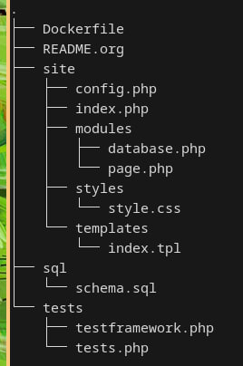
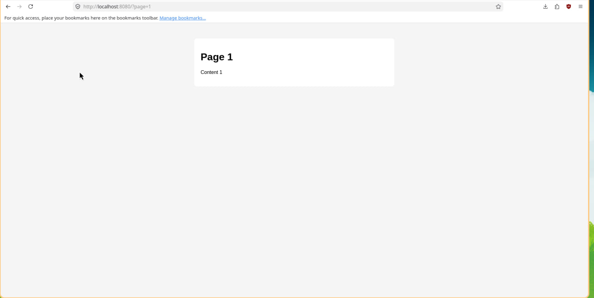
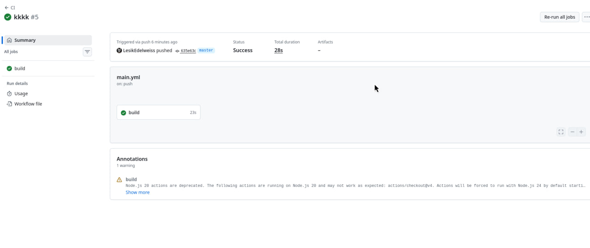

#+TITLE: Лабораторная работа: Настройка CI с Github Actions

Пустовой Алексей IA2404

* Цель работы
Освоить настройку непрерывной интеграции (CI) с использованием Github
Actions и Docker-контейнеров.

* Задание
Создать Web-приложение на PHP, реализовать работу с базой данных
SQLite, написать тесты и настроить CI с помощью Github Actions.

* Выполнение работы

** 1. Создание структуры проекта
Был создан репозиторий *containers08* и базовая структура проекта.

** 2. Создание SQL схемы базы данных
Был создан файл *sql/schema.sql*, содержащий структуру таблицы и
начальные данные.

#+begin_src sql
CREATE TABLE page (
    id INTEGER PRIMARY KEY AUTOINCREMENT,
    title TEXT,
    content TEXT
);

INSERT INTO page (title, content) VALUES ('Page 1', 'Content 1');
INSERT INTO page (title, content) VALUES ('Page 2', 'Content 2');
INSERT INTO page (title, content) VALUES ('Page 3', 'Content 3');
#+end_src

** 3. Реализация Web-приложения
Создано приложение на PHP с использованием классов Database и Page.

Пример обращения к базе данных:

#+begin_src php
$data = $db->Read("page", 1);
#+end_src

** 6. Написание тестов
Реализованы тесты для проверки работы методов класса Database и Page.

#+begin_src php
return assertExpression($db->Count("page") >= 3);
#+end_src

** 7. Создание Dockerfile
Создан Dockerfile для сборки контейнера с PHP и SQLite.

#+begin_src dockerfile
FROM php:7.4-fpm as base

RUN apt-get update && \
    apt-get install -y sqlite3 libsqlite3-dev && \
    docker-php-ext-install pdo_sqlite

VOLUME ["/var/www/db"]

COPY sql/schema.sql /var/www/db/schema.sql

RUN echo "prepare database" && \
    cat /var/www/db/schema.sql | sqlite3 /var/www/db/db.sqlite && \
    chmod 777 /var/www/db/db.sqlite && \
    rm -rf /var/www/db/schema.sql && \
    echo "database is ready"

COPY site /var/www/html
#+end_src

** 7. Настройка Github Actions
Создан файл *.github/workflows/main.yml* для автоматического запуска
CI.

#+begin_src yaml
name: CI

on:
  push:
    branches:
      - main
  pull_request:
    branches:
      - main

jobs:
  build:
    runs-on: ubuntu-latest
    steps:
      - name: Checkout
        uses: actions/checkout@v4

      - name: Build the Docker image
        run: docker build -t containers08 .

      - name: Create container
        run: docker create --name container --volume database:/var/www/db containers08

      - name: Copy tests to container
        run: docker cp ./tests container:/var/www/html

      - name: Start container
        run: docker start container

      - name: Run tests
        run: docker exec container php /var/www/html/tests/tests.php

      - name: Stop container
        run: docker stop container

      - name: Remove container
        run: docker rm container

      - name: Remove image
        run: docker rmi containers08
#+end_src

** 8. Запуск CI
После отправки проекта в репозиторий, Github Actions автоматически
запустил сборку контейнера и тесты, которые успешно прошли.

* Ответы на вопросы

** Что такое непрерывная интеграция?
Непрерывная интеграция (CI) - это процесс автоматического тестирования
и сборки проекта при каждом изменении кода.

** Для чего нужны юнит-тесты? Как часто их нужно запускать?
Юнит-тесты позволяют проверять корректность отдельных компонентов
программы. Их следует запускать при каждом изменении кода.

** Что изменить для запуска при Pull Request?
Необходимо добавить обработку события pull_request:

#+begin_src yaml
on:
  pull_request:
    branches:
      - main
#+end_src

** Как удалять образы после тестов?
Необходимо добавить шаг удаления Docker-образа:

#+begin_src yaml
- name: Remove image
  run: docker rmi containers08
#+end_src

* Выводы
В ходе лабораторной работы было разработано Web-приложение на PHP,
реализована работа с базой данных SQLite, написаны тесты и настроена
система непрерывной интеграции с использованием Github Actions и
Docker. Это позволило автоматизировать процесс тестирования и повысить
надежность приложения.
